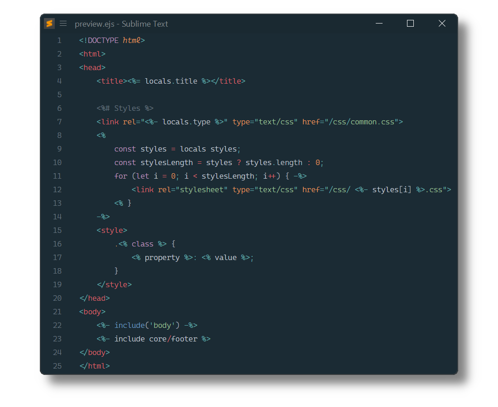

# EJS

[EJS](http://ejs.co/) syntax definition for Sublime Text based on its HTML, CSS and JavaScript syntax definitions.

Supported template tag variants are: `<% %>`. `<? ?>`.

## Installation

### Package Control

The easiest way to install is using [Package Control](https://packagecontrol.io). It's listed as `EJS`.

1. Open `Command Palette` using <kbd>ctrl+shift+P</kbd> or menu item `Tools → Command Palette...`
2. Choose `Package Control: Install Package`
3. Find `EJS` and hit <kbd>Enter</kbd>

### Manual Install

1. Download appropriate [EJS.sublime-package](https://github.com/SublimeText/EJS/releases) for your Sublime Text build.
2. Copy it into _Installed Packages_ directory

> [!NOTE]
>
> To find _Installed Packages_...
>
> 1. call _Menu > Preferences > Browse Packages.._
> 2. Navigate to parent folder

### Setting the default syntax

By default, files with the extension `.ejs` are opened with the `EJS (<% %>)` syntax.

To open files with a different extension as EJS, or to use delimiters other than `<% %>`, follow these steps to set the default EJS syntax for a file extension:

1. Open an EJS file
2. Select `View` from the menu bar
3. Then select: `Syntax` &rarr; `Open all with current extension as...` &rarr; `EJS` &rarr; `EJS (<delimiter>)`
4. Repeat for each extension you want to open as EJS

## Snippets

In the HTML scope:

+ `if`+`TAB` - Inserts EJS `if` statement
+ `for`+`TAB` - Inserts EJS `for` loop

## Troubleshooting

### §1 Syntax Definition Parse Errors

EJS extends Sublime Text's HTML, CSS and JavaScript syntax definition.

If EJS syntax highlighting doesn't work 
and console displays syntax errors in _Vue Component.sublime-syntax_,
please make sure to remove any out-dated syntax override.

Steps:

1. call _Menu > Preferences > Browse Packages.._
2. Look for _HTML_, _CSS_ or _JavaScript_ folder
3. Remove them or at least delete any syntax definition in it.

### §2 Scripts are not correctly highlighted

EJS relies on JavaScript (`source.js`)
to scope script blocks and inline scripts.

Make sure to remove related out-dated syntax packages,
which don't meet least compatibility requirements.

They can be identified by calling 
e.g. `sublime.find_syntax_by_scope("source.js")` in ST's console.

Known candidates are:

- [JavaScriptNext - ES6 Syntax](https://packagecontrol.io/packages/JavaScriptNext%20-%20ES6%20Syntax)
- [Naomi](https://github.com/borela/naomi)

## Contributing

Most problems are best addressed by opening an [issue](https://github.com/SublimeText/EJS/issues).
